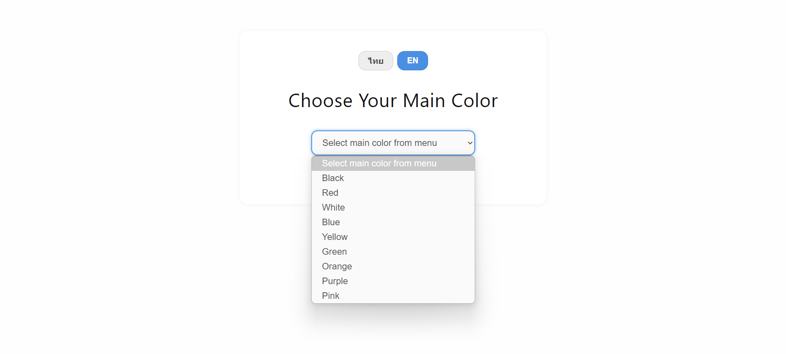
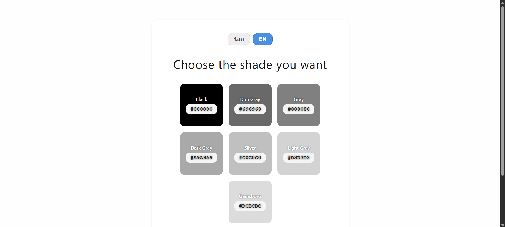
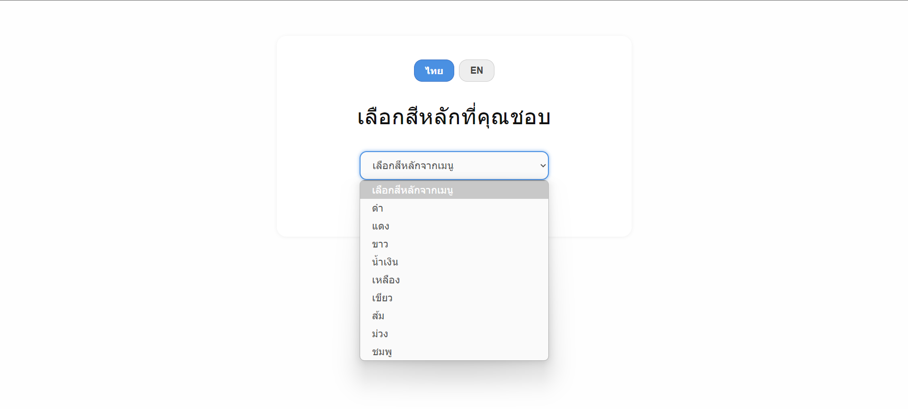
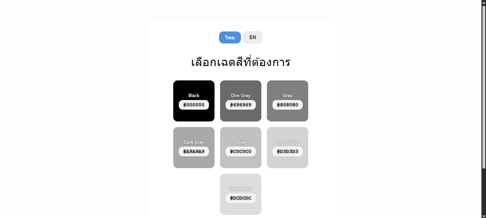

<h1 align="center">🎨 ShadeShift</h1>
<p align="center">
  A minimal color shade explorer — select a base color and discover its beautiful tones with names and HEX codes.
</p>

<p align="center">
  
  
  
</p>

---

## ✨ Features

- 🎯 **Base Color Selection**: Choose from common base colors like red, blue, green, etc.
- 🌈 **Shade Explorer**: Instantly displays shades with real names and HEX codes.
- 📋 **One-Click Copy**: Click a shade to copy its HEX code to your clipboard.
- 🌐 **Multi-language Support**: Toggle between English and Thai (🇺🇸/🇹🇭).
- 💡 **Accessible UI**: Designed with readability and color contrast in mind.
- 📱 **Responsive & Minimal**: Clean, modern UI works across devices.

---

## 📸 Preview






---

## 🚀 Getting Started

Clone this repo and open the `index.html` in your browser. No build tools or dependencies needed.

```bash
git clone https://github.com/DevNatapohn/ShadeShift.git
cd ShadeShift
open index.html
